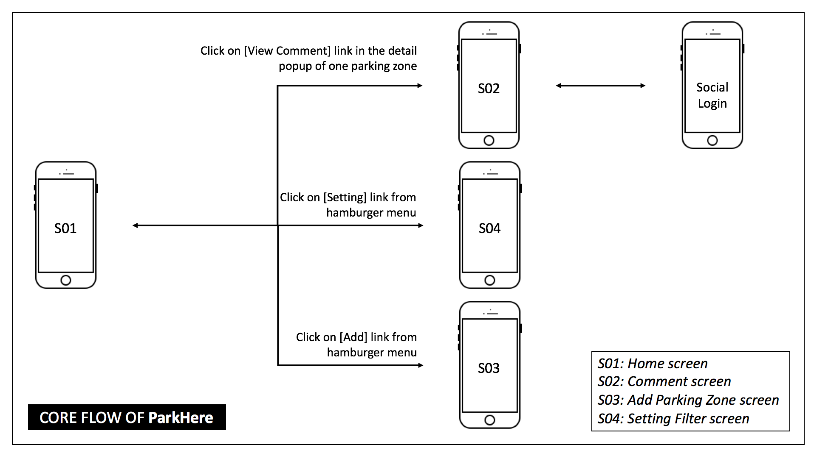

# Group Project - *ParkHere*

**ParkHere** is our solution for finding the most suitable parking zone based on user's location & user's criteria.

## User Stories

We support these following required functions at our first version (1.0):

- [ ] HOME screen
   - [ ] Display a map with the user's current location as the central point.
   - [ ] Display all the suitable parking zones that are around the central point.
   - [ ] Support 4 quick filter options on the map directly: type of transport (in this version they are: bicycle, motorbike and car), the parking zone with the lowest fee, the parking zone that is nearest the central point and the parking zones that are still opening.
   - [ ] Support selecting one parking zone by 2 ways: input the address into search textfield or choosing one parking zone on the map directly.
   - [ ] Draw the route from the user's current location to one selected parking zone.
   - [ ] Show the detail information of one parking zone under the popup form by clicking on the corresponding maker on the map.
   
- [ ] COMMENT screen
   - [ ] Display the selected parking zone on the mini map at the top.
   - [ ] List all corresponding comments.
   - [ ] Add new comments with text or photo (taking directly from camera phone or choosing one from gallery).
   - [ ] Add rating. 
   - [ ] Support commenting in anonymous mode (no need to login).
   - [ ] Support commenting in login mode (login with Facebook or Google account).
   
- [ ] FILTER SETTING screen 
   - [ ] Set the default transport types (can select all).
   - [ ] Set the default distance.
   - [ ] Set the default expected range of fee.
   - [ ] Set the default time frame.
   
- [ ] ADD PARKING ZONE screen (login required)
   - [ ] Add new parking zone.
   
- [ ] NON-FUNCTIONAL features
   - [ ] Support multilingual.
   - [ ] Support social log-in with Facebook/Google account (the current signed in user will be persisted across restarts).

The following **optional** features will be considered in the first version:

- [ ] Save filter history of user.
- [ ] Update status of the parking zone on real time (for i.e: now the parking zone is full filled).
- [ ] Support for more transport types (for i.e: truck).
- [ ] Change theme.

## Core Flow

## Video Walkthrough

Here's a walkthrough of implemented user stories:

GIF created with [LiceCap](http://www.cockos.com/licecap/).

## Notes

Describe any challenges encountered while building the app.

## License

    Copyright 2017 DPT

    Licensed under the Apache License, Version 2.0 (the "License");
    you may not use this file except in compliance with the License.
    You may obtain a copy of the License at

        http://www.apache.org/licenses/LICENSE-2.0

    Unless required by applicable law or agreed to in writing, software
    distributed under the License is distributed on an "AS IS" BASIS,
    WITHOUT WARRANTIES OR CONDITIONS OF ANY KIND, either express or implied.
    See the License for the specific language governing permissions and
    limitations under the License.
